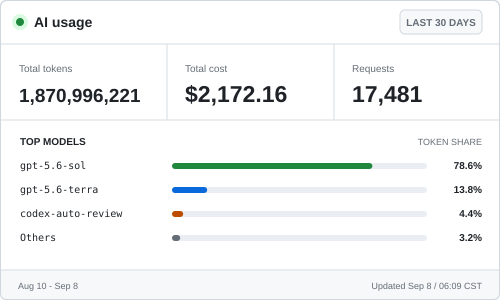

# AI-token监控面板

<picture>
  <source media="(prefers-color-scheme: dark)" srcset="./assets/ai-usage/ai-usage-dark.svg">
  
</picture>

个人多设备 AI CLI 用量看板。运行时直接读取 Claude Code 和 Codex 的原生日志，不再依赖 CCSwitch；每天将各设备的绝对统计同步到 Cloudflare Worker + D1，再由 GitHub Actions 更新现有 SVG。

前端和统计窗口保持不变：

- Total tokens：Fresh Input + Output + Cache Read + Cache Creation
- Total cost：按 CCSwitch 3.18.0 的模型价格与缓存计价语义计算
- Requests：最近 30 个自然日的请求总数
- Top 3 models：按总 Token 排序并展示占比

## 后端结构

```text
Claude/Codex 原生日志
        |
        | 每 60 秒，仅本地采集
        v
npm CLI 本地账本
        |
        | 每天 03:10，同步绝对桶
        v
Cloudflare Worker + D1
        |
        | 每天 03:30，读取最近 30 天
        v
GitHub Actions -> 原 Python 渲染器 -> 现有 SVG
```

原设备保留主 `SYNC_KEY`，其他设备通过 10 分钟一次性配对码领取各自的设备 token，并生成独立随机 `device_id`。服务端以 `device_id + 日期 + 来源 + 模型` 为唯一桶，并按设备同步序号覆盖绝对值；跨设备查询时再求和，因此重试不会翻倍，不同设备会正确累加。

## 开始使用

1. 按 [Worker 部署文档](./packages/worker/README.md)创建 D1、部署 Worker，并配置两个独立密钥。
2. 在原设备按 [CLI 迁移文档](./packages/cli/README.md)导出一次 CCSwitch 种子并初始化。
3. 原设备运行 `ai-token-dashboard pair`，其他设备只执行输出的 `npx ... setup <pairing-string>` 命令。
4. 在仓库 Secrets 中配置 `DASHBOARD_API_URL` 和 `DASHBOARD_READ_KEY`，手动运行一次 `Update AI usage dashboard` 工作流。

CCSwitch 只用于首次保留已有历史；种子完成后可以退出或卸载。

## 验证

```powershell
npm test
npm run test:python
```

数据口径、迁移对账和 SVG 生成器说明见 [`tools/ai-usage-dashboard/README.md`](./tools/ai-usage-dashboard/README.md)。
